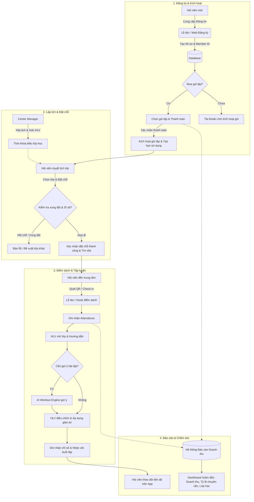
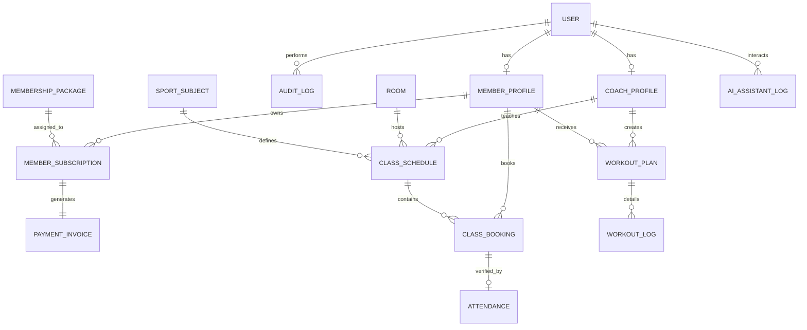

# Software Development Blueprint: Sports Center Management System

**Project Code:** MinhTTH5 (Project ID: 4)  
**System Name:** Hệ thống Quản lý Trung tâm Thể thao (Sports Center Management System)  
**Status:** Approved & Ready for Implementation  
**Version:** 1.0  
**Owner:** Senior Business Analyst (BA Blueprint Agent)  
**Last updated:** 2026-09-14  
**Source Document:** [srs.txt](file:///Users/penpen1112003/Demo/WS_01_FU/srs.txt)

---

## 1. Executive Summary

- **Business problem:**
  1. Quản lý thủ công, phân tán giữa lịch dạy, phòng tập, gói hội viên và theo dõi điểm danh dẫn đến sai sót số liệu và xung đột lịch.
  2. Thiếu quy trình đối soát tự động hóa doanh thu và báo cáo tiến độ theo thời gian thực (ngày/tuần/tháng/quý/năm).
  3. Trải nghiệm hội viên chưa liền mạch khi đăng ký, gia hạn gói tập, đặt phòng/lớp và hủy lịch.
  4. Huấn luyện viên (Coach) mất nhiều thời gian tổng hợp hồ sơ tập luyện và đánh giá học viên mà thiếu công cụ gợi ý thông minh.
  5. Nhân viên lễ tân chịu áp lực quá tải thao tác quầy vào khung giờ cao điểm khi vừa đón tiếp, kiểm tra thẻ, thu tiền và giải đáp khiếu nại.
- **Desired outcome:**
  1. Số hóa 100% vòng đời vận hành trung tâm thể thao: tài khoản, gói tập, lịch học, điểm danh, thanh toán và báo cáo quản trị.
  2. Tự động kiểm soát xung đột tài nguyên (phòng tập, HLV, sĩ số tối đa) với cơ chế cảnh báo sớm.
  3. Minh bạch hóa doanh thu, xuất hóa đơn tức thì và cung cấp hệ thống báo cáo đa chiều hỗ trợ ban giám đốc ra quyết định kịp thời.
  4. Tích hợp AI đóng vai trò trợ lý tư vấn dịch vụ và gợi ý bài tập cá nhân hóa dựa trên thể trạng, mục tiêu và lịch sử luyện tập.
- **Success metrics:**
  1. **Hiệu suất vận hành:** Giảm 75% thời gian xử lý thủ tục tại quầy của Lễ tân (check-in/điểm danh dưới 5 giây/thành viên).
  2. **Độ chính xác:** 0% xung đột lịch phòng tập và lịch dạy của HLV; sai lệch đối soát doanh thu dưới 0.01%.
  3. **Tỷ lệ giữ chân:** Tăng 25% tỷ lệ gia hạn gói tập của hội viên nhờ tính năng nhắc hạn tự động và kế hoạch tập luyện cá nhân hóa.
  4. **Thời gian phản hồi:** 90% câu hỏi dịch vụ thường gặp được trợ lý AI giải đáp tự động trong vòng 3 giây.
- **Recommended direction:**
  - Xây dựng hệ thống web/mobile responsive tập trung theo kiến trúc mô-đun hóa (Modular Architecture), phân tách độc lập giữa Core Operations (User, Booking, Payment, Attendance) và AI Cognitive Services (Recommendation & Assistant). AI chỉ đóng vai trò tư vấn, hỗ trợ quyết định (decision-support), không can thiệp trực tiếp vào logic hạch toán hoặc phân quyền nghiệp vụ.

---

## 2. Scope

### In scope

- **Capability 1 (Flow 1 - User & Membership Management):** Quản trị tài khoản đa vai trò (RBAC), đăng ký/cập nhật hồ sơ, quản lý danh mục gói hội viên (giá, thời hạn, điều kiện), cấp phát thẻ, khóa/mở thẻ và gia hạn gói tập.
- **Capability 2 (Flow 2 - Class Booking & Schedule Management):** Quản lý bộ môn, lớp học, lịch học, phòng tập, phân công HLV; hội viên tự đặt/hủy lớp trực tuyến; kiểm tra sĩ số trống, chống xung đột thời gian (concurrency lock); cảnh báo lớp sắp đầy.
- **Capability 3 (Flow 3 - Payment & Report Management):** Ghi nhận giao dịch thanh toán quầy/online, xuất hóa đơn điện tử; báo cáo doanh thu đa kỳ (ngày/tuần/tháng/quý/năm), thống kê hội viên mới, tỷ lệ lấp đầy lớp học.
- **Capability 4 (Flow 4 - Training & Attendance Management):** HLV lập giáo án/kế hoạch tập luyện nhóm hoặc cá nhân (1-on-1); điểm danh hội viên (QR/thẻ từ/lễ tân); ghi nhận chỉ số thể lực, kết quả tập luyện và đánh giá định kỳ.
- **Capability 5 (Flow 5 - AI Workout Recommendation):** AI engine phân tích mục tiêu (giảm mỡ, tăng cơ, phục hồi), độ tuổi, chỉ số thể lực và lịch sử tập để gợi ý bài tập, tần suất và cường độ tối ưu, cảnh báo quá tải.
- **Capability 6 (Flow 6 - AI Assistant):** Chatbot hỗ trợ hội viên tra cứu lịch tập, nội quy lớp, chính sách gói tập; gửi thông báo đẩy nhắc lịch học và thông báo hạn thẻ.

### Out of scope (Phase 1)

- Tích hợp cổng thanh toán quốc tế đa tiền tệ (chỉ hỗ trợ VND qua chuyển khoản/tiền mặt/cổng nội địa).
- Tự động điều khiển phần cứng IoT cổng xoay barrier (chỉ xuất mã QR và xác thực trên phần mềm lễ tân).
- Hệ thống quản lý suất ăn, dinh dưỡng chuyên sâu ngoài phạm vi giáo án bài tập.
- Tính năng mua bán phụ kiện thể thao, thực phẩm bổ sung (E-commerce store bán lẻ).

---

## 3. Stakeholders and Users

| ID | Role | Responsibility | Decision/approval |
|---|---|---|---|
| ST-001 | Center Manager (Quản lý Trung tâm) | Phê duyệt chính sách gói tập, bảng giá, phân quyền nhân sự, duyệt báo cáo tài chính và điều phối toàn bộ tài nguyên trung tâm. | Quyết định cuối cùng về quy trình, chính sách giá và nghiệm thu hệ thống. |
| ST-002 | Coach (Huấn luyện viên) | Quản lý học viên, lập kế hoạch bài tập, điểm danh buổi tập, đánh giá tiến độ học viên, sử dụng AI hỗ trợ soạn giáo án. | Phê duyệt giáo án, đánh giá năng lực và xác nhận hoàn thành buổi tập. |
| ST-003 | Member (Hội viên / Thành viên) | Sử dụng ứng dụng để đăng ký gói tập, đặt lịch lớp, check-in, tương tác với bài tập, nhận xét của HLV và hỏi trợ lý AI. | Quyết định mua/gia hạn gói tập, lựa chọn lịch học cá nhân. |
| ST-004 | Receptionist (Nhân viên Lễ tân) | Tiếp đón hội viên, đăng ký thành viên mới tại quầy, điểm danh check-in trực tiếp, thu tiền và in/xuất hóa đơn, hỗ trợ đổi/hủy lớp. | Xác nhận giao dịch thu tiền mặt/POS tại quầy, xác thực thông tin giấy tờ thành viên. |
| ST-005 | Product Owner / Lead BA | Chịu trách nhiệm chuyển hóa SRS thành Blueprint, điều phối quy chuẩn tài liệu và giám sát chất lượng phân tích. | Phê duyệt Blueprint và nghiệm thu tiêu chí bàn giao (Acceptance Criteria). |
| ST-006 | Tech Lead / Engineering | Chịu trách nhiệm triển khai kiến trúc, thiết kế database, API và bảo đảm hiệu năng hệ thống. | Thẩm định tính khả thi kỹ thuật và kiến trúc dữ liệu/API. |
| ST-007 | QA/QC Lead | Xây dựng kịch bản kiểm thử (Test Cases), tự động hóa kiểm thử dựa trên Gherkin AC và xác nhận Ready/Done. | Ký duyệt biên bản kiểm thử (Test Evidence Sign-off). |

---

## 4. Assumptions, Constraints and Open Questions

| ID | Type | Statement | Owner | Status |
|---|---|---|---|---|
| A-001 | Assumption | Mọi hội viên đều sở hữu thiết bị thông minh (smartphone) có khả năng cài app hoặc truy cập web responsive để nhận thông báo và đặt lớp. | Lead BA | Confirmed |
| A-002 | Assumption | Nhân viên lễ tân luôn trực quầy với thiết bị máy tính kết nối mạng ổn định để xử lý check-in và hóa đơn trực tiếp. | Center Manager | Confirmed |
| A-003 | Assumption | Thuật toán AI gợi ý bài tập chỉ mang tính tham khảo; HLV có toàn quyền điều chỉnh giáo án nếu hội viên có bệnh lý nền đặc biệt. | Tech Lead & Coach | Confirmed |
| C-001 | Constraint | Mỗi giao dịch thanh toán hoặc đặt lịch phải tuân thủ cơ chế khóa giao dịch (Transaction Lock) nhằm triệt tiêu xung đột ghi đè dữ liệu. | Tech Lead | Confirmed |
| C-002 | Constraint | Dữ liệu cá nhân (số điện thoại, CCCD, thông tin thanh toán, bệnh lý cá nhân) phải tuân thủ nghị định bảo vệ dữ liệu cá nhân (PDPD). | Security / Legal | Confirmed |
| C-003 | Constraint | Sĩ số phòng tập không được vượt quá tải trọng thiết kế và quy chuẩn an toàn PCCC của trung tâm. | Center Manager | Confirmed |
| Q-001 | Open Question | Chính sách hoàn/hủy buổi tập: Cho phép hội viên hủy trước giờ tập tối thiểu bao nhiêu tiếng để không bị trừ buổi/phí phạt? (Đề xuất: 2 tiếng). | Center Manager | Pending Decision |
| Q-002 | Open Question | Hội viên có được bảo lưu (freeze) gói tập khi có lý do cá nhân (công tác, sức khỏe) không, và thời gian bảo lưu tối đa là bao lâu? | Center Manager | Pending Decision |
| Q-003 | Open Question | Khi lớp học đã đầy, hệ thống có cần cơ chế danh sách chờ (Waitlist) tự động đôn người lên khi có người hủy lớp không? | Product Owner | Pending Decision |

---

## 5. Process Analysis

### 5.1. Phân tích hiện trạng (AS-IS) vs Tương lai (TO-BE)

| Step | Current state (AS-IS) | Future state (TO-BE) | Actor/system | Rule or exception |
|---|---|---|---|---|
| 1. Tiếp nhận & Đăng ký hội viên | Ghi thông tin vào sổ tay hoặc file Excel; mất thời gian nhập lại và dễ sai sót số điện thoại/ngày sinh. | Hội viên tự đăng ký qua Mobile/Web hoặc Lễ tân nhập nhanh trên giao diện CRM tập trung, tạo mã Member ID duy nhất. | Member / Receptionist / System | Bắt buộc kiểm tra trùng số điện thoại/email; tự động mã hóa mật khẩu. |
| 2. Mua & Gia hạn gói tập | Viết phiếu thu tay, theo dõi hạn dùng gói tập trên file bảng tính rời rạc; thường xuyên bỏ sót ngày hết hạn. | Hệ thống hiển thị danh mục gói tập, tự tính ngày hết hạn dựa trên cấu hình gói; phát sinh Transaction ID và gửi thông báo nhắc trước 7 ngày. | Receptionist / Member / System | Gói tập chỉ kích hoạt sau khi trạng thái thanh toán chuyển `Paid`. |
| 3. Xếp lịch & Phân công HLV | Quản lý sắp lịch trên bảng trắng hoặc nhóm chat; HLV dễ bị trùng ca dạy ở hai phòng khác nhau. | Center Manager xếp lịch trên Calendar kéo thả; hệ thống tự động kiểm tra xung đột trùng phòng và trùng giờ dạy của HLV. | Center Manager / System | **BR-001**: 1 HLV không thể đứng 2 lớp trong cùng khung giờ; 1 phòng không chứa 2 lớp đồng thời. |
| 4. Đặt chỗ & Check-in lớp học | Hội viên gọi điện đặt chỗ; lễ tân ghi sổ; đến giờ tập hội viên ký tên vào giấy điểm danh. | Hội viên đặt chỗ trước qua App (xem trước sĩ số còn trống); khi đến phòng, quét mã QR/thẻ từ tại quầy để check-in tức thì trong 2 giây. | Member / Receptionist / Coach | **BR-002**: Chỉ cho phép đặt lịch khi gói tập còn hiệu lực; chặn đặt khi lớp đã đạt `max_capacity`. |
| 5. Theo dõi giáo án & Tiến độ | HLV nhớ bài tập theo cảm tính hoặc ghi sổ tay cá nhân; hội viên không nắm được lộ trình tăng trưởng thể lực. | HLV tạo Workout Plan trên hệ thống; AI gợi ý bài tập theo mục tiêu; sau mỗi buổi HLV chấm điểm danh và log chỉ số (tạ, rep, BMI). | Coach / Member / AI Engine | **BR-003**: Dữ liệu chỉ số tập luyện là riêng tư, chỉ Member và Coach phụ trách được xem. |
| 6. Quyết toán & Báo cáo | Kế toán mất 3-5 ngày cuối tháng đối chiếu sổ thu chi với sao kê ngân hàng để làm báo cáo doanh thu. | Dashboard báo cáo thời gian thực: Doanh thu theo ngày/tháng/gói dịch vụ, biểu đồ tăng trưởng hội viên, xuất file Excel/PDF chuẩn hóa 1 cú click. | Center Manager / System | Dữ liệu giao dịch kế toán lưu vết Audit Log bất biến, không thể xóa trực tiếp. |

### 5.2. Sơ đồ quy trình nghiệp vụ tổng thể (Mermaid Workflow)



---

## 6. Requirements

### 6.1. Business Requirements (Yêu cầu nghiệp vụ cốt lõi)

| ID | Type | Requirement Statement | Priority | Source | Status |
|---|---|---|---|---|---|
| BR-001 | Business | Trung tâm phải quản lý toàn bộ chu trình sống của thành viên từ lúc tạo hồ sơ, mua gói, bảo lưu, gia hạn đến khi hết hạn để tối đa hóa doanh thu và chăm sóc khách hàng. | P0 Critical | SRS Section 1, 3 (Flow 1) | Approved |
| BR-002 | Business | Trung tâm phải tối ưu hóa công suất khai thác phòng tập và thời gian của huấn luyện viên, triệt tiêu tình trạng quá tải hoặc lớp học bị trống lãng phí. | P0 Critical | SRS Section 3 (Flow 2) | Approved |
| BR-003 | Business | Toàn bộ dòng tiền thanh toán (tiền mặt, thẻ, chuyển khoản) phải được hạch toán minh bạch, đối soát thời gian thực và tự động tạo báo cáo tài chính định kỳ. | P0 Critical | SRS Section 3 (Flow 3) | Approved |
| BR-004 | Business | Nâng cao chất lượng đào tạo thông qua việc số hóa giáo án và ứng dụng AI cá nhân hóa lộ trình tập luyện, tạo lợi thế cạnh tranh trên thị trường thể thao. | P1 High | SRS Section 3 (Flow 4, 5, 6) | Approved |

### 6.2. Functional Requirements (Yêu cầu chức năng chuẩn hóa)

Mẫu chuẩn: `Hệ thống phải [hành vi] cho [actor] khi [điều kiện], để đạt [kết quả]`.

| ID | Capability | Functional Requirement | Priority | Source | Acceptance Criteria |
|---|---|---|---|---|---|
| FR-001 | User & Auth | Hệ thống phải xác thực người dùng dựa trên thông tin đăng nhập (Username/Email/Phone và Password) và phân quyền chính xác theo 4 vai trò (Center Manager, Coach, Receptionist, Member) khi đăng nhập vào hệ thống, để ngăn chặn truy cập trái phép. | P0 Critical | SRS Sec 2, Sec 4 | Given thông tin đăng nhập hợp lệ, When người dùng submit form, Then hệ thống sinh JWT session và chuyển hướng đúng Dashboard theo vai trò. |
| FR-002 | Member Mgmt | Hệ thống phải cho phép Lễ tân và Quản lý tạo mới, cập nhật hồ sơ cá nhân và khóa/mở tài khoản thành viên khi nhận yêu cầu, để duy trì dữ liệu khách hàng chính xác. | P0 Critical | Flow 1 | Given thông tin hội viên hợp lệ, When Lễ tân bấm lưu, Then hệ thống lưu DB, sinh Member ID duy nhất và thông báo thành công. |
| FR-003 | Package Mgmt | Hệ thống phải cho phép Center Manager cấu hình danh mục gói tập (Tên, Giá, Thời hạn ngày, Bộ môn áp dụng, Số lượt tập tối đa) khi tạo mới/chỉnh sửa gói, để áp dụng chính sách kinh doanh linh hoạt. | P0 Critical | Flow 1 | Given gói tập mới có tên và giá > 0, When Manager lưu, Then gói hiển thị trên danh mục bán và tính đúng ngày hết hạn khi kích hoạt. |
| FR-004 | Subscription | Hệ thống phải tự động tính ngày bắt đầu, ngày kết thúc và cập nhật trạng thái gói tập (`Active`, `Expired`, `Suspended`) khi hội viên thanh toán thành công, để kiểm soát quyền lợi tập luyện. | P0 Critical | Flow 1, Flow 3 | Given hóa đơn gói tập chuyển `Paid`, When trigger kích hoạt gói chạy, Then trạng thái Member Subscription đổi thành `Active` và gửi thông báo cho Member. |
| FR-005 | Class Scheduling | Hệ thống phải cho phép Center Manager tạo lịch lớp học, chỉ định phòng tập, khung giờ và phân công HLV phụ trách khi lập kế hoạch tuần/tháng, để hình thành thời khóa biểu vận hành. | P0 Critical | Flow 2 | Given HLV và Phòng tập chưa có lịch trùng trong khung giờ, When Manager gán lịch, Then hệ thống lưu và hiển thị lớp trên thời khóa biểu. |
| FR-006 | Conflict Prevention | Hệ thống phải tự động kiểm tra và ngăn chặn việc xếp lịch trùng phòng tập hoặc trùng giờ của HLV khi Center Manager lưu lịch học, để bảo đảm tính khả thi vận hành. | P0 Critical | Flow 2, Sec 6 | Given HLV A đã có lịch dạy từ 08:00 - 09:00 tại Phòng 1, When Manager xếp HLV A dạy Phòng 2 lúc 08:30, Then hệ thống báo lỗi xung đột và từ chối lưu. |
| FR-007 | Class Booking | Hệ thống phải cho phép Hội viên tìm kiếm lớp theo bộ môn/ngày và đặt chỗ trực tuyến khi gói tập còn hiệu lực và lớp còn chỗ trống, để hội viên chủ động sắp xếp thời gian. | P0 Critical | Flow 2 | Given gói tập còn hạn và sĩ số hiện tại < max_capacity, When Member chọn đặt chỗ, Then hệ thống ghi nhận booking, trừ 1 slot trống và sinh mã booking. |
| FR-008 | Booking Cancellation | Hệ thống phải cho phép Hội viên hủy đăng ký lớp học trước giờ bắt đầu tối thiểu 2 tiếng khi có việc bận, để giải phóng slot trống cho người khác. | P1 High | Flow 2, Q-001 | Given thời điểm hủy cách giờ học >= 2 tiếng, When Member bấm hủy, Then hệ thống hoàn lại 1 slot trống và đổi trạng thái booking thành `Cancelled`. |
| FR-009 | Capacity Alert | Hệ thống phải tự động gửi cảnh báo cho Quản lý và hiển thị nhãn "Sắp đầy" trên App khi sĩ số đăng ký lớp đạt >= 90% công suất phòng, để hỗ trợ điều phối thêm lớp hoặc phòng lớn hơn. | P2 Medium | Flow 2 | Given lớp có max 20 học viên, When học viên thứ 18 đăng ký thành công, Then hệ thống đánh dấu cờ `Almost_Full` và thông báo tới Center Manager. |
| FR-010 | Payment Recording | Hệ thống phải cho phép Lễ tân ghi nhận khoản thu tiền mặt, POS thẻ hoặc chuyển khoản ngân hàng và in/xuất hóa đơn điện tử khi hội viên mua/gia hạn gói, để hoàn tất thanh toán. | P0 Critical | Flow 3 | Given thông tin số tiền khớp với giá gói, When Lễ tân bấm thanh toán, Then hệ thống tạo hóa đơn, chuyển trạng thái `Paid` và cho phép tải PDF hóa đơn. |
| FR-011 | Revenue Analytics | Hệ thống phải tổng hợp và trực quan hóa doanh thu theo ngày, tuần, tháng, quý, năm, lọc theo gói tập và loại dịch vụ cho Center Manager khi truy cập mục Báo cáo, để đánh giá sức khỏe tài chính. | P0 Critical | Flow 3 | Given khoảng thời gian hợp lệ, When Manager chọn xem báo cáo, Then hệ thống kết xuất bảng dữ liệu và biểu đồ doanh thu tương ứng trong < 2 giây. |
| FR-012 | Attendance Check-in | Hệ thống phải cho phép Lễ tân hoặc Coach quét mã QR / nhập ID để điểm danh hội viên tham gia lớp khi hội viên đến phòng tập, để ghi nhận chuyên cần và trừ số buổi. | P0 Critical | Flow 4 | Given Member có booking hợp lệ của lớp trong ngày, When quét QR thành công, Then trạng thái chuyển `Attended` kèm timestamp chính xác. |
| FR-013 | Workout Planning | Hệ thống phải cho phép Coach tạo và cập nhật kế hoạch luyện tập cá nhân hoặc giáo án nhóm (danh sách bài tập, số sets, reps, trọng lượng tạ, thời gian nghỉ) khi phân công lớp, để định hướng lộ trình tập. | P1 High | Flow 4 | Given lớp hoặc học viên được chỉ định, When Coach lưu giáo án, Then học viên có thể xem chi tiết bài tập trên ứng dụng của mình. |
| FR-014 | Progress Tracking | Hệ thống phải cho phép Coach ghi nhận kết quả tập luyện (số kg đạt được, nhịp tim, nhận xét kỹ thuật) sau mỗi buổi tập khi kết thúc buổi dạy, để theo dõi tiến độ cải thiện thể lực. | P1 High | Flow 4 | Given buổi tập đã điểm danh, When Coach nhập kết quả và gửi nhận xét, Then hệ thống lưu hồ sơ và thông báo tới tài khoản Member. |
| FR-015 | AI Workout Recommendation | Hệ thống phải sử dụng mô hình AI để phân tích hồ sơ thể trạng (tuổi, giới tính, BMI, mục tiêu, chấn thương cũ) và lịch sử tập để gợi ý danh sách bài tập phù hợp cho Coach và Member khi có yêu cầu, để tối ưu hiệu quả tập luyện. | P2 Medium | Flow 5 | Given hồ sơ học viên đầy đủ, When người dùng nhấn "Gợi ý bài tập AI", Then hệ thống trả về danh sách 3-5 bài tập kèm số set/rep khuyến nghị trong < 3 giây. |
| FR-016 | AI Assistant Chat | Hệ thống phải cung cấp giao diện chat AI để trả lời tự động các câu hỏi của hội viên về thời khóa biểu, chính sách gói tập, kỹ thuật bài tập cơ bản và quy định phòng tập khi hội viên gửi tin nhắn, để giải đáp 24/7. | P2 Medium | Flow 6 | Given câu hỏi về nội dung trung tâm, When Member gửi tin nhắn chat, Then AI phân tích context dữ liệu trung tâm và trả lời chính xác, lịch sự trong < 3 giây. |
| FR-017 | Push Notification | Hệ thống phải tự động gửi thông báo qua Mobile App / Web / Email cho hội viên trước buổi học 60 phút hoặc trước ngày hết hạn gói tập 7 ngày khi thỏa mãn điều kiện thời gian, để hạn chế việc quên lịch và kích thích gia hạn. | P1 High | Flow 6 | Given buổi học diễn ra lúc 18:00, When đồng hồ hệ thống điểm 17:00 cùng ngày, Then hệ thống kích hoạt gửi thông báo nhắc lịch cho các thành viên có booking. |
| FR-018 | Audit Trail Logging | Hệ thống phải tự động lưu vết mọi thao tác quan trọng (thay đổi phân quyền, xóa dữ liệu, điều chỉnh giá, hủy hóa đơn, ghi đè lịch) kèm User ID, IP và Timestamp khi sự kiện xảy ra, để phục vụ thanh tra và kiểm soát rủi ro. | P0 Critical | SRS Sec 2 (Manager) | Given thao tác cập nhật bảng giá hoặc hủy booking, When giao dịch DB thực thi, Then 1 bản ghi Audit Log bất biến được chèn vào bảng log hệ thống. |

---

## 7. Use Cases and User Stories

### 7.1. Use Cases chính

#### UC-001: Đặt chỗ lớp học thể thao trực tuyến (Book Class Online)

- **Actor:** Member (Hội viên)
- **Trigger:** Hội viên có nhu cầu tham gia một lớp học cụ thể và truy cập vào danh sách lớp trên ứng dụng.
- **Preconditions:**
  1. Hội viên đã đăng nhập tài khoản thành công.
  2. Gói thành viên của hội viên đang ở trạng thái `Active` và có quyền tham gia bộ môn này.
- **Main flow:**
  1. Hội viên mở màn hình "Thời khóa biểu lớp học".
  2. Hệ thống hiển thị danh sách lớp theo ngày, bộ môn, HLV và số lượng slot trống (`available_slots = max_capacity - booked_count`).
  3. Hội viên chọn một lớp học còn trống chỗ và bấm nút "Đặt chỗ".
  4. Hệ thống kiểm tra điều kiện:
     - Gói tập còn hiệu lực vào ngày học.
     - Hội viên chưa đặt lớp nào khác trùng khung giờ.
     - Số slot trống > 0.
  5. Hệ thống thực hiện khóa bản ghi (transaction lock), tăng `booked_count` lên 1, tạo bản ghi `ClassBooking` với trạng thái `Confirmed`.
  6. Hệ thống tạo mã QR Check-in riêng cho buổi học.
  7. Hệ thống hiển thị thông báo "Đặt lớp thành công" và thêm lịch vào mục "Lịch tập cá nhân".
- **Alternate/error flows:**
  - *4a. Lớp học vừa hết chỗ:* Hệ thống thông báo "Lớp học đã đủ sĩ số, vui lòng chọn khung giờ khác hoặc đăng ký danh sách chờ" và làm mới lại số slot.
  - *4b. Trùng khung giờ:* Hệ thống cảnh báo "Bạn đã có lịch học lớp [Tên lớp] từ [Giờ bắt đầu] đến [Giờ kết thúc]" và từ chối đặt.
  - *4c. Gói tập hết hạn trước ngày học:* Hệ thống thông báo "Gói tập của bạn sẽ hết hạn vào ngày [Ngày]. Vui lòng gia hạn để tiếp tục đặt lịch".
- **Postconditions:**
  - Bản ghi Booking được lưu trữ thành công; số chỗ trống của lớp giảm đi 1; lịch học được đồng bộ vào calendar cá nhân của học viên và danh sách lớp của HLV.

---

#### UC-002: Điểm danh hội viên tại quầy hoặc phòng tập (Member Check-in)

- **Actor:** Receptionist (Lễ tân) / Coach (Huấn luyện viên)
- **Trigger:** Hội viên đến trung tâm và xuất trình mã QR trên điện thoại hoặc đọc số điện thoại/Member ID.
- **Preconditions:**
  1. Lễ tân/HLV đã đăng nhập vào hệ thống điểm danh.
  2. Hội viên đã đăng ký tài khoản trong hệ thống.
- **Main flow:**
  1. Lễ tân quét mã QR của hội viên bằng đầu đọc/camera hoặc tìm kiếm theo số điện thoại trên hệ thống.
  2. Hệ thống truy xuất hồ sơ hội viên và hiển thị:
     - Thông tin cá nhân, ảnh chân dung.
     - Danh sách gói tập đang hoạt động và thời hạn.
     - Danh sách lớp học đã đặt trong ngày hôm nay.
  3. Lễ tân chọn buổi tập tương ứng và bấm "Xác nhận Check-in".
  4. Hệ thống ghi nhận trạng thái `Attended`, gắn nhãn thời gian thực (check-in timestamp), trừ số buổi (nếu là gói tính buổi).
  5. Hệ thống hiển thị thông báo màn hình xanh "Check-in thành công: Chào mừng [Tên hội viên]".
- **Alternate/error flows:**
  - *2a. Thẻ/Gói tập đã hết hạn:* Hệ thống cảnh báo viền đỏ "Gói tập đã hết hạn vào ngày [X]". Hệ thống đề xuất Lễ tân chuyển hướng sang quy trình thu phí gia hạn.
  - *2b. Hội viên chưa đặt chỗ trước nhưng lớp còn chỗ:* Hệ thống thông báo "Chưa đặt lịch trước. Lớp còn 3 chỗ trống, bạn có muốn đăng ký vãng lai ngay không?". Lễ tân xác nhận để ghi danh bổ sung.
  - *2c. Mã QR không hợp lệ/hết hạn:* Hệ thống thông báo lỗi và yêu cầu xác thực bằng số điện thoại.
- **Postconditions:**
  - Bản ghi `Attendance` được tạo; HLV mở app lên thấy hội viên đã xuất hiện tại trung tâm.

---

#### UC-003: Gợi ý bài tập cá nhân hóa bằng AI (AI Workout Recommendation)

- **Actor:** Coach (Huấn luyện viên) / Member (Hội viên)
- **Trigger:** Người dùng muốn tham khảo lịch trình và bài tập phù hợp với mục tiêu thể lực mới.
- **Preconditions:**
  1. Hồ sơ hội viên có đủ thông tin thể trạng: Chiều cao, cân nặng, độ tuổi, giới tính, mục tiêu (ví dụ: Giảm mỡ / Tăng cơ), mức độ tập luyện (Beginner / Intermediate / Advanced).
- **Main flow:**
  1. Người dùng vào mục "Kế hoạch tập luyện" -> Bấm "Gợi ý từ AI".
  2. Hệ thống tổng hợp dữ liệu thể trạng, các chấn thương ghi nhận và lịch sử bài tập 30 ngày gần nhất thành payload gửi sang AI Engine.
  3. AI Engine xử lý phân tích và trả về cấu trúc bài tập:
     - Nhóm cơ tập trung (Chest, Back, Legs, Core,...).
     - Danh sách 4-6 bài tập cụ thể, kèm số set, rep range, thời gian nghỉ (Rest time).
     - Lời khuyên cường độ nhịp tim và lưu ý phòng ngừa chấn thương.
  4. Hệ thống hiển thị bản nháp gợi ý lên giao diện.
  5. (Nếu là Coach): Coach điều chỉnh các thông số cho phù hợp thực tế và bấm "Áp dụng vào giáo án học viên".
  6. Hệ thống lưu kế hoạch vào hồ sơ tập luyện của học viên.
- **Alternate/error flows:**
  - *2a. Thiếu chỉ số cơ bản:* Hệ thống yêu cầu cập nhật cân nặng, chiều cao trước khi sử dụng AI.
  - *3a. AI service timeout (> 5 giây):* Hệ thống hiển thị thông báo lỗi nhẹ và nạp bài tập mẫu chuẩn theo mục tiêu từ thư viện tĩnh (Fallback Rule).
- **Postconditions:**
  - Kế hoạch tập luyện được kích hoạt; Member có thể xem chi tiết từng bài tập cùng video hướng dẫn.

---

### 7.2. User Stories (Chuẩn INVEST & Gherkin AC)

#### US-001: Đăng ký thành viên mới tại quầy
- **Statement:** Là **Nhân viên Lễ tân**, tôi muốn **nhập thông tin cá nhân và đăng ký tài khoản mới cho khách hàng tại quầy**, để **họ chính thức trở thành hội viên của trung tâm thể thao**.
- **Priority:** Must-have (P0)
- **Dependency:** FR-001, FR-002
- **Source Requirement:** FR-002
- **Acceptance Criteria (Gherkin):**
  ```gherkin
  Scenario: Đăng ký thành viên thành công với thông tin hợp lệ
    Given Lễ tân đang ở màn hình "Thêm mới hội viên"
    When Lễ tân nhập họ tên "Nguyễn Văn A", số điện thoại "0912345678", email "vana@gmail.com" và ngày sinh hợp lệ
    And Bấm nút "Tạo tài khoản"
    Then Hệ thống lưu thông tin vào cơ sở dữ liệu
    And Sinh mã Member ID duy nhất theo định dạng "MEM-XXXX"
    And Hiển thị thông báo "Tạo tài khoản hội viên thành công"
    And Gửi tin nhắn SMS/Email chứa mật khẩu khởi tạo cho hội viên

  Scenario: Báo lỗi khi số điện thoại đã tồn tại trên hệ thống
    Given Số điện thoại "0912345678" đã được đăng ký cho hội viên khác
    When Lễ tân nhập số điện thoại "0912345678" và bấm "Tạo tài khoản"
    Then Hệ thống ngăn chặn việc lưu dữ liệu
    And Hiển thị thông báo lỗi "Số điện thoại này đã được đăng ký cho hội viên khác trong hệ thống"
  ```

---

#### US-002: Đặt chỗ lớp học trực tuyến qua ứng dụng
- **Statement:** Là **Hội viên**, tôi muốn **chọn lớp học và đặt chỗ trước thông qua ứng dụng**, để **đảm bảo tôi có vị trí tập luyện phù hợp mà không lo hết chỗ khi đến phòng tập**.
- **Priority:** Must-have (P0)
- **Dependency:** FR-003, FR-005, FR-007
- **Source Requirement:** FR-007
- **Acceptance Criteria (Gherkin):**
  ```gherkin
  Scenario: Đặt lớp thành công khi thỏa mãn điều kiện
    Given Hội viên đang đăng nhập và có gói tập Gym-Yoga còn hạn đến ngày "2026-12-31"
    And Lớp "Yoga Buổi Sáng" ngày mai còn 5 chỗ trống
    When Hội viên bấm nút "Đặt chỗ" cho lớp này
    Then Hệ thống trừ 1 chỗ trống của lớp (còn lại 4)
    And Tạo bản ghi đặt chỗ với trạng thái "Confirmed"
    And Hiển thị mã QR vé vào lớp trên màn hình điện thoại

  Scenario: Từ chối đặt chỗ khi lớp học đã đầy
    Given Lớp "Spinning Đốt Mỡ" đã có 20/20 người đăng ký
    When Hội viên bấm nút "Đặt chỗ"
    Then Nút đặt chỗ bị vô hiệu hóa (disabled)
    And Hệ thống hiển thị thông báo "Lớp học đã đạt sĩ số tối đa, vui lòng chọn ca học khác"
  ```

---

#### US-003: Ghi nhận thanh toán và xuất hóa đơn
- **Statement:** Là **Nhân viên Lễ tân**, tôi muốn **chọn gói tập, ghi nhận hình thức thanh toán của khách và in hóa đơn**, để **hoàn tất kích hoạt quyền lợi gói tập cho hội viên một cách minh bạch**.
- **Priority:** Must-have (P0)
- **Dependency:** FR-003, FR-004, FR-010
- **Source Requirement:** FR-010
- **Acceptance Criteria (Gherkin):**
  ```gherkin
  Scenario: Thanh toán gói tập bằng chuyển khoản ngân hàng thành công
    Given Hội viên "MEM-1002" mua gói "Full Access 6 Tháng" giá 6,000,000 VND
    When Lễ tân chọn hình thức "Chuyển khoản / QR Bank" và nhập mã chuẩn chi giao dịch
    And Nhấn "Xác nhận thanh toán"
    Then Hệ thống tạo hóa đơn mã "INV-YYYYMM-XXXX" với trạng thái "Paid"
    And Kích hoạt gói tập cho hội viên có hạn sử dụng đúng 180 ngày kể từ hôm nay
    And Hệ thống cho phép in trực tiếp hoặc xuất file PDF hóa đơn
  ```

---

#### US-004: Điểm danh và ghi nhận kết quả tập luyện
- **Statement:** Là **Huấn luyện viên**, tôi muốn **điểm danh học viên và ghi lại chỉ số tạ/rep/thể lực sau buổi tập**, để **theo dõi sát sao tiến độ và cải thiện giáo án cho học viên**.
- **Priority:** Should-have (P1)
- **Dependency:** FR-012, FR-013, FR-014
- **Source Requirement:** FR-014
- **Acceptance Criteria (Gherkin):**
  ```gherkin
  Scenario: Ghi nhận kết quả buổi tập thành công
    Given Buổi tập 1-kèm-1 giữa HLV và học viên "Trần Thị B" đã hoàn thành điểm danh
    When HLV nhập kết quả bài Squat "3 sets x 10 reps @ 50kg" và nhận xét "Kỹ thuật gối tốt, cần chú ý siết cơ bụng"
    And Nhấn "Lưu kết quả"
    Then Hệ thống lưu dữ liệu vào lịch sử tập luyện của học viên
    And Gửi thông báo tóm tắt buổi tập tới ứng dụng của học viên trong vòng 30 giây
  ```

---

#### US-005: Báo cáo phân tích doanh thu trung tâm
- **Statement:** Là **Quản lý Trung tâm**, tôi muốn **xem báo cáo doanh thu tổng hợp theo thời gian thực phân theo ngày, tháng, gói tập**, để **nắm bắt tình hình kinh doanh và điều chỉnh chiến lược vận hành**.
- **Priority:** Must-have (P0)
- **Dependency:** FR-010, FR-011
- **Source Requirement:** FR-011
- **Acceptance Criteria (Gherkin):**
  ```gherkin
  Scenario: Xem báo cáo doanh thu tháng hiện tại
    Given Quản lý đăng nhập với vai trò "Center Manager"
    When Quản lý truy cập trang "Báo cáo Doanh thu" và lọc thời gian từ "2026-09-01" đến "2026-09-30"
    Then Hệ thống hiển thị tổng doanh thu, biểu đồ doanh thu theo từng ngày
    And Bảng phân bổ cơ cấu doanh thu theo từng gói thành viên
    And Thời gian tải dữ liệu báo cáo không vượt quá 2 giây
  ```

---

#### US-006: Hỏi đáp thông tin với Trợ lý AI
- **Statement:** Là **Hội viên**, tôi muốn **chat trực tiếp với trợ lý ảo AI để hỏi về thời khóa biểu, chính sách phòng tập và hướng dẫn bài tập**, để **nhận được câu trả lời nhanh chóng bất kỳ lúc nào mà không cần chờ nhân viên trực quầy**.
- **Priority:** Could-have (P2)
- **Dependency:** FR-016
- **Source Requirement:** FR-016
- **Acceptance Criteria (Gherkin):**
  ```gherkin
  Scenario: Hỏi đáp lịch học với AI Assistant thành công
    Given Hội viên mở widget chat "Trợ lý Thể thao AI"
    When Hội viên gửi câu hỏi "Hôm nay có lớp Yoga nào sau 18h không?"
    Then AI Assistant phân tích dữ liệu lịch học hiện tại
    And Trả lời danh sách các lớp Yoga bắt đầu sau 18:00 hôm nay kèm tên HLV và số chỗ trống
    And Đính kèm nút "Đặt chỗ ngay" dẫn thẳng tới lớp học đó
  ```

---

## 8. Data Model

### 8.1. Danh mục thực thể (Entity Catalogue)

| Entity | Primary Key | Key Fields | Relationships & Cardinality | Lifecycle / Status | Data Classification | Owner |
|---|---|---|---|---|---|---|
| `User` | `user_id` (UUID) | `username`, `password_hash`, `full_name`, `email`, `phone`, `role`, `is_active`, `created_at` | 1 - 1 với `MemberProfile` hoặc `CoachProfile` | `Active`, `Inactive`, `Locked` | Confidential (PII) | Center Manager |
| `MemberProfile` | `member_id` (UUID) | `user_id`, `member_code`, `date_of_birth`, `gender`, `height_cm`, `weight_kg`, `fitness_goal`, `medical_notes` | N - 1 với `User`; 1 - N với `Subscription`, `Booking` | `Active`, `Suspended` | Restricted (Health/PII) | Member & Manager |
| `CoachProfile` | `coach_id` (UUID) | `user_id`, `coach_code`, `specialties`, `bio`, `rating`, `hire_date` | N - 1 với `User`; 1 - N với `Class`, `WorkoutPlan` | `Active`, `On_Leave`, `Terminated` | Internal | Center Manager |
| `MembershipPackage` | `package_id` (UUID) | `package_name`, `description`, `price`, `duration_days`, `session_limit`, `sport_type`, `is_active` | 1 - N với `MemberSubscription` | `Draft`, `Active`, `Archived` | Internal | Center Manager |
| `MemberSubscription`| `subscription_id` (UUID)| `member_id`, `package_id`, `start_date`, `end_date`, `remaining_sessions`, `status` | N - 1 với `MemberProfile`; N - 1 với `Package`; 1 - 1 với `Invoice` | `Pending`, `Active`, `Expired`, `Cancelled` | Confidential | Receptionist / Manager |
| `SportSubject` | `subject_id` (UUID) | `subject_name`, `category`, `description` | 1 - N với `Class` | `Active`, `Inactive` | Public | Center Manager |
| `Room` | `room_id` (UUID) | `room_name`, `capacity`, `location`, `equipment_info`, `status` | 1 - N với `ClassSchedule` | `Available`, `Maintenance` | Internal | Center Manager |
| `ClassSchedule` | `class_id` (UUID) | `subject_id`, `room_id`, `coach_id`, `start_time`, `end_time`, `max_capacity`, `booked_count`, `status` | N - 1 với `Subject`, `Room`, `Coach`; 1 - N với `Booking` | `Scheduled`, `Ongoing`, `Completed`, `Cancelled` | Internal | Center Manager |
| `ClassBooking` | `booking_id` (UUID) | `class_id`, `member_id`, `booking_time`, `qr_code`, `status` | N - 1 với `ClassSchedule`; N - 1 với `MemberProfile` | `Confirmed`, `Attended`, `Cancelled`, `No_Show` | Internal | Member & Receptionist |
| `Attendance` | `attendance_id` (UUID)| `booking_id`, `checkin_time`, `checkin_by`, `verification_method` | 1 - 1 với `Booking` | `Recorded`, `Audited` | Internal | Receptionist / Coach |
| `WorkoutPlan` | `plan_id` (UUID) | `member_id`, `coach_id`, `title`, `goal`, `notes`, `created_at` | N - 1 với `Member`; N - 1 với `Coach`; 1 - N với `WorkoutLog` | `Active`, `Completed`, `Archived` | Restricted | Coach |
| `WorkoutLog` | `log_id` (UUID) | `plan_id`, `exercise_name`, `sets`, `reps`, `weight_kg`, `coach_feedback`, `logged_at` | N - 1 với `WorkoutPlan` | `Recorded` | Restricted | Coach & Member |
| `PaymentInvoice` | `invoice_id` (UUID) | `invoice_number`, `member_id`, `subscription_id`, `amount`, `payment_method`, `payment_status`, `paid_at` | N - 1 với `Member`; 1 - 1 với `Subscription` | `Unpaid`, `Paid`, `Refunded`, `Cancelled` | Confidential (Financial) | Receptionist / Manager |
| `AIAssistantLog` | `chat_log_id` (UUID) | `user_id`, `session_id`, `query_text`, `ai_response`, `latency_ms`, `feedback_rating`, `created_at` | N - 1 với `User` | `Logged` | Internal | System / DevOps |
| `AuditLog` | `audit_id` (UUID) | `table_name`, `record_id`, `action`, `old_values`, `new_values`, `performed_by`, `ip_address`, `timestamp` | N - 1 với `User` | `Immutable` | Restricted (Audit) | System Admin |

---

### 8.2. Sơ đồ thực thể quan hệ (Entity Relationship Diagram - Mermaid)



---

## 9. API and Integration Contract

Tất cả các API được bảo vệ bằng cơ chế xác thực JWT Bearer Token, gửi kèm Header: `Authorization: Bearer <token>`.

| API ID | Method & Path | Purpose | Auth & Roles | Request Schema (Key Attributes) | Response Schema | Errors & Edge Cases |
|---|---|---|---|---|---|---|
| `API-001` | `POST /api/v1/auth/login` | Đăng nhập hệ thống, cấp JWT access & refresh token. | Public | `{ "username": "string", "password": "string" }` | `{ "access_token": "string", "role": "string", "user": { ... } }` | `401 Unauthorized` (sai mật khẩu); `403 Forbidden` (tài khoản bị khóa). |
| `API-002` | `POST /api/v1/members` | Đăng ký thành viên mới tại quầy hoặc online. | `Receptionist`, `Center_Manager` | `{ "full_name": "string", "phone": "string", "email": "string", "dob": "YYYY-MM-DD", "gender": "string" }` | `{ "member_id": "UUID", "member_code": "string", "created_at": "timestamp" }` | `409 Conflict` (số điện thoại/email đã tồn tại); `422 Unprocessable` (dữ liệu sai format). |
| `API-003` | `GET /api/v1/classes` | Lấy danh sách lớp học theo bộ môn và ngày. | Authenticated (`Member`, `Coach`, `Receptionist`, `Manager`) | Query params: `date`, `subject_id`, `coach_id`, `status` | `{ "classes": [ { "class_id": "UUID", "subject_name": "string", "room_name": "string", "start_time": "ISO", "max_capacity": 20, "booked_count": 14 } ] }` | `400 Bad Request` (ngày không đúng định dạng). |
| `API-004` | `POST /api/v1/classes` | Tạo lịch lớp học mới, phân công HLV và phòng. | `Center_Manager` | `{ "subject_id": "UUID", "room_id": "UUID", "coach_id": "UUID", "start_time": "ISO", "end_time": "ISO", "max_capacity": 20 }` | `{ "class_id": "UUID", "status": "Scheduled" }` | `409 Conflict` (HLV bận hoặc phòng đã có lớp trong khung giờ); `400 Bad Request` (start >= end). |
| `API-005` | `POST /api/v1/bookings` | Hội viên đặt chỗ tham gia lớp học. | `Member` (hoặc `Receptionist` đặt hộ) | `{ "class_id": "UUID", "member_id": "UUID" }` | `{ "booking_id": "UUID", "status": "Confirmed", "qr_code": "string" }` | `409 Conflict` (lớp đã đầy hoặc trùng giờ); `403 Forbidden` (gói tập hết hạn); `429 Rate Limit`. |
| `API-006` | `DELETE /api/v1/bookings/{id}` | Hủy đặt chỗ lớp học. | `Member`, `Receptionist`, `Manager` | URL Param: `id` (booking_id); Reason text. | `{ "success": true, "message": "Booking cancelled successfully" }` | `400 Bad Request` (hủy muộn hơn quy định 2 tiếng trước giờ học); `404 Not Found`. |
| `API-007` | `POST /api/v1/attendance/checkin` | Quét mã xác nhận điểm danh hội viên. | `Receptionist`, `Coach` | `{ "qr_code": "string", "verification_method": "QR / Manual" }` | `{ "attendance_id": "UUID", "member_name": "string", "class_name": "string", "checkin_time": "ISO" }` | `404 Not Found` (mã QR không hợp lệ); `409 Conflict` (đã check-in trước đó); `403 Forbidden` (thẻ hết hạn). |
| `API-008` | `POST /api/v1/payments/invoices` | Lập hóa đơn và xác nhận thanh toán gói tập. | `Receptionist`, `Center_Manager` | `{ "member_id": "UUID", "package_id": "UUID", "amount": 6000000, "payment_method": "CASH/CARD/TRANSFER", "transaction_ref": "string" }` | `{ "invoice_id": "UUID", "invoice_number": "string", "status": "Paid", "subscription_id": "UUID" }` | `400 Bad Request` (số tiền không khớp); `500 Internal Error` (lỗi hạch toán giao dịch). |
| `API-009` | `GET /api/v1/reports/revenue` | Truy vấn báo cáo doanh thu đa chiều. | `Center_Manager` | Query params: `from_date`, `to_date`, `group_by=day/month`, `package_id` | `{ "total_revenue": 150000000, "details": [ ... ], "summary_by_package": [ ... ] }` | `403 Forbidden` (không đủ quyền Manager); `400 Bad Request` (khoảng ngày > 365 ngày). |
| `API-010` | `POST /api/v1/ai/workout-recommendations`| AI gợi ý danh sách bài tập theo thể trạng. | `Coach`, `Member` | `{ "member_id": "UUID", "target_muscle": "string", "intensity": "Moderate", "duration_minutes": 60 }` | `{ "recommendations": [ { "exercise": "string", "sets": 4, "reps": 12, "notes": "string" } ], "ai_disclaimer": "string" }` | `422 Unprocessable` (thiếu dữ liệu thể trạng); `504 Gateway Timeout` (AI phản hồi chậm > 5s -> nạp fallback). |
| `API-011` | `POST /api/v1/ai/assistant/chat` | Chatbot AI hỗ trợ tư vấn dịch vụ trung tâm. | Authenticated / Public (Session-based)| `{ "session_id": "string", "message": "string" }` | `{ "reply": "string", "suggestions": [ "string" ], "action_link": "string" }` | `429 Too Many Requests` (chống spam bot chat > 20 req/min); `500 Internal Error`. |

---

## 10. Non-Functional Requirements (NFR)

| ID | Category | Target | Measurement Method | Priority | Owner |
|---|---|---|---|---|---|
| `NFR-001` | Performance (API Latency) | Thời gian phản hồi cho 95% các truy vấn nghiệp vụ thường (P95) < 300ms; đối với API báo cáo tổng hợp P95 < 2000ms. | Giám sát APM (Datadog/NewRelic/Prometheus) trong điều kiện tải bình thường và giờ cao điểm. | P0 Critical | Tech Lead |
| `NFR-002` | Performance (Concurrency) | Hệ thống chịu tải đồng thời tối thiểu 500 người dùng hoạt động (concurrent users) và 50 giao dịch booking/giây không gây nghẽn hoặc race-condition. | Kiểm thử tải (Load Testing với k6 / JMeter) mô phỏng đợt mở đăng ký lớp cao điểm. | P0 Critical | QA Lead & DevOps |
| `NFR-003` | Availability | Độ sẵn sàng hệ thống đạt 99.5% uptime trong khung giờ hoạt động trung tâm (05:30 - 22:30 hàng ngày). | Đo lường bằng công cụ Pingdom / UptimeRobot hàng tháng; tính MTTR < 30 phút. | P0 Critical | DevOps Engineer |
| `NFR-004` | Security (Authentication) | Mật khẩu được băm bằng thuật toán an toàn (Argon2id hoặc Bcrypt với cost factor >= 12); Session token JWT có thời hạn tối đa 60 phút và refresh token tự động hủy khi đăng xuất. | Quét lỗ hổng bảo mật SAST/DAST và kiểm thử thâm nhập (Penetration Test) trước khi bàn giao. | P0 Critical | Security Lead |
| `NFR-005` | Security (Authorization) | Thực thi nghiêm ngặt phân quyền vai trò (Role-Based Access Control - RBAC) tại mọi tầng API; không bao giờ để xảy ra lỗi phân quyền đối tượng trực tiếp (BOLA / IDOR). | Unit Test & Integration Test kiểm tra toàn bộ matrix quyền hạn của 4 vai trò. | P0 Critical | Tech Lead & QA |
| `NFR-006` | Privacy & Compliance | Thông tin cá nhân hội viên và dữ liệu sức khỏe/thể trạng phải được mã hóa ở mức lưu trữ (Encryption at Rest - AES-256) và truyền tải (TLS 1.3). Tuân thủ nghị định bảo vệ dữ liệu PDPD. | Kiểm toán an ninh thông tin định kỳ; rà soát cấu hình mã hóa Database và SSL/TLS. | P0 Critical | Security Lead |
| `NFR-007` | Operability (Audit Trail) | 100% các thao tác thay đổi trạng thái tài chính, hủy hóa đơn, chỉnh sửa lịch và cấp quyền phải được ghi log bất biến (append-only audit log) lưu trữ tối thiểu 12 tháng. | Kiểm tra cơ chế Database Trigger / Event Log; xác minh không thể can thiệp sửa đổi bảng log. | P1 High | Lead BA & Tech Lead |
| `NFR-008` | Accessibility & UX | Giao diện tương thích hoàn toàn (responsive) trên màn hình máy tính để bàn (Lễ tân/Quản lý) và màn hình điện thoại di động (Hội viên/HLV: iOS/Android từ viewport 375px trở lên). | Cross-browser & device testing trên BrowserStack / máy thật; kiểm tra độ tương phản chuẩn WCAG 2.1 AA. | P1 High | UI/UX Designer & QA |
| `NFR-009` | AI Reliability & Fallback | Thời gian xử lý gợi ý AI không vượt quá 3 giây. Nếu AI Gateway gặp sự cố hoặc timeout, hệ thống phải tự động chuyển sang tập quy tắc giáo án tĩnh (Static Fallback Rule), không được làm treo luồng nghiệp vụ chính. | Tự động giả lập kịch bản ngắt mạng AI trong quá trình kiểm thử tự động (Chaos/Resilience Testing). | P2 Medium | AI Engineer & Tech Lead |

---

## 11. Security, Privacy and Compliance

- **Authentication and authorization:**
  - Triển khai xác thực qua chuẩn OAuth2/JWT. Mọi request đều được xác minh token và gắn ngữ cảnh vai trò (`Center_Manager`, `Coach`, `Receptionist`, `Member`).
  - Phân quyền động theo nguyên tắc đặc quyền tối thiểu (Principle of Least Privilege). Lễ tân không thể xem báo cáo lợi nhuận tổng thể; Coach không thể sửa đổi gói thanh toán của hội viên.
- **Sensitive data and classification:**
  - Dữ liệu tài chính (số tiền, phương thức, mã chuẩn chi) xếp hạng `Confidential`.
  - Dữ liệu định danh cá nhân (PII: Số điện thoại, CCCD/CMND, Email) và dữ liệu sức khỏe (bệnh lý, cân nặng, nhịp tim) xếp hạng `Restricted`.
  - Mọi trường dữ liệu xếp hạng Restricted phải được mặt nạ hóa (masking) khi hiển thị trên giao diện chung (chỉ hiển thị 4 số cuối điện thoại cho các vai trò không phải Admin).
- **Audit and traceability:**
  - Mỗi bản ghi giao dịch thanh toán hoặc điều chỉnh lịch phải gắn kèm `created_by`, `updated_by`, `ip_address` và `timestamp`.
  - Nghiêm cấm lệnh `HARD DELETE` trên các bảng dữ liệu vận hành chính (Users, Subscriptions, Bookings, Invoices); sử dụng cơ chế `SOFT DELETE` (`is_deleted = true`) kết hợp lưu vết Audit Log.
- **Retention/deletion:**
  - Dữ liệu hóa đơn kế toán lưu trữ tối thiểu 5 năm theo Luật Kế toán.
  - Dữ liệu điểm danh và chat log với AI được lưu trữ 12 tháng, sau đó được tự động nén đưa vào kho lưu trữ nguội (Cold Storage).
- **Applicable policy or regulation:**
  - Tuân thủ Nghị định 13/2023/NĐ-CP về Bảo vệ dữ liệu cá nhân (PDPD).
  - Tuân thủ tiêu chuẩn an toàn thanh toán cơ bản (không lưu trữ số thẻ ngân hàng đầy đủ của khách hàng trên hệ thống nội bộ).

---

## 12. Delivery Plan and Dependencies

| Increment | Scope | Key Deliverables | Dependency | Exit Criteria | Risk |
|---|---|---|---|---|---|
| **Sprint 1: Core Foundation & Auth** | Setup môi trường, Database Schema, User Management, Authentication & RBAC (FR-001, FR-002, NFR-004, NFR-005). | Kiến trúc nền tảng, Seed data 4 vai trò, API Auth, màn hình Quản lý thành viên. | Khởi tạo repository, cấu hình CI/CD. | 100% test cases Auth & RBAC pass; phân quyền thành công trên Staging. | Chậm trễ chốt schema dữ liệu phân quyền. |
| **Sprint 2: Membership & Payments** | Quản lý gói tập, mua/gia hạn gói, module thanh toán quầy và xuất hóa đơn (FR-003, FR-004, FR-010, NFR-007). | API Gói tập & Hóa đơn, giao diện thanh toán của Lễ tân, mẫu hóa đơn PDF. | Hoàn thành Sprint 1 (User data). | Giao dịch thanh toán chính xác 100%, sinh mã hóa đơn duy nhất, kích hoạt đúng hạn thẻ. | Xử lý lỗi làm tròn tiền hoặc xung đột mã hóa đơn. |
| **Sprint 3: Scheduling & Booking Engine** | Xếp lịch phòng/HLV, công cụ chống xung đột lịch, đặt/hủy chỗ trực tuyến, cảnh báo sĩ số (FR-005, FR-006, FR-007, FR-008, FR-009, NFR-002). | Thời khóa biểu kéo thả, màn hình đặt lịch của Hội viên, cơ chế transaction locking. | Hoàn thành Sprint 2 (Kiểm tra điều kiện gói tập). | Chạy kịch bản Load test 50 req/s không bị trùng slot hoặc đặt vượt quá sĩ số phòng. | Concurrency lock làm tăng độ trễ DB. |
| **Sprint 4: Training & Attendance** | Điểm danh bằng QR code, quản lý kế hoạch tập luyện, theo dõi chỉ số thể lực học viên (FR-012, FR-013, FR-014, NFR-008). | Module quét QR check-in quầy, giao diện tạo giáo án của HLV, biểu đồ tiến độ học viên. | Hoàn thành Sprint 3 (Lịch lớp & Booking). | Check-in hoàn tất trong < 2 giây; HLV lưu kết quả bài tập hiển thị ngay trên App hội viên. | Thiết bị quét mã tại quầy không tương thích tốt. |
| **Sprint 5: Analytics & AI Capabilities** | Dashboard báo cáo doanh thu quản trị, AI gợi ý bài tập, Trợ lý ảo AI Assistant (FR-011, FR-015, FR-016, FR-017, NFR-001, NFR-009). | Báo cáo doanh thu đa kỳ, AI recommendation engine, AI chatbot widget, Push notification. | Hoàn thành Sprint 2 & 4 (Dữ liệu thanh toán và thể trạng). | Doanh thu kết xuất < 2s; AI trả lời đúng nghiệp vụ trong < 3s; có fallback khi AI lỗi. | Tích hợp AI chi phí cao hoặc độ trễ phản hồi vượt ngưỡng. |
| **Sprint 6: Security, UAT & Release** | Audit trail, kiểm thử tải tổng thể, pentest bảo mật, đào tạo người dùng và bàn giao (FR-018, NFR-003, NFR-006). | Báo cáo UAT nghiệm thu, tài liệu hướng dẫn vận hành, triển khai Production. | Hoàn thành toàn bộ Sprint 1-5. | 100% tiêu chí chấp nhận đạt; không còn lỗi Critical/High; ký duyệt nghiệm thu. | Phát sinh lỗi bảo mật cần vá gấp trước giờ G. |

---

## 13. Traceability Matrix

| Business Goal | Requirement ID | Use Case / Story | Data Entity / API | NFR & Test Evidence |
|---|---|---|---|---|
| **BG-01: Tối ưu hóa vận hành & số hóa quản lý** | `FR-001` (Authentication) | `US-001` (Tạo tài khoản) | `User`, `Role` / `API-001` | `NFR-004`, `NFR-005` (Pass RBAC test suite) |
| | `FR-002` (Member Mgmt) | `US-001` (Đăng ký quầy) | `MemberProfile` / `API-002` | `NFR-008` (Form validation test) |
| | `FR-005` (Scheduling) | `UC-001` (Đặt lớp) | `ClassSchedule`, `Room` / `API-004` | `NFR-001` (Query latency < 300ms) |
| | `FR-006` (Anti-conflict) | `UC-001` (Kiểm tra lịch) | `ClassSchedule` / `API-004` | `NFR-002` (0% duplicate room/coach test) |
| | `FR-012` (Attendance) | `UC-002` (Check-in QR) | `Attendance`, `Booking` / `API-007` | `NFR-008` (Check-in time < 2s test) |
| | `FR-018` (Audit Trail) | System Policy | `AuditLog` / Internal Trigger | `NFR-007` (Audit trail immutability test) |
| **BG-02: Nâng cao trải nghiệm hội viên** | `FR-007` (Class Booking) | `UC-001`, `US-002` (Đặt chỗ) | `ClassBooking` / `API-005` | `NFR-002` (50 concurrent booking test) |
| | `FR-008` (Cancellation) | `UC-001` (Hủy chỗ) | `ClassBooking` / `API-006` | Test case hủy trước 2h thành công |
| | `FR-017` (Notification) | `US-002` (Nhắc lịch) | `NotificationQueue` / Worker | Push notification deliver trong 60s |
| **BG-03: Minh bạch tài chính & doanh thu** | `FR-003` (Package Mgmt) | `US-003` (Cấu hình gói) | `MembershipPackage` / API-Package | Kiểm tra công thức tính ngày hết hạn |
| | `FR-004` (Subscription) | `US-003` (Kích hoạt thẻ) | `MemberSubscription` / DB Trigger | Kích hoạt đúng hạn ngay khi thanh toán |
| | `FR-010` (Payment Billing) | `US-003` (Thanh toán quầy) | `PaymentInvoice` / `API-008` | `NFR-007` (Hóa đơn không mất mát số) |
| | `FR-011` (Revenue Analytics)| `US-005` (Báo cáo tháng) | `PaymentInvoice` / `API-009` | `NFR-001` (Báo cáo tải < 2000ms) |
| **BG-04: Đột phá đào tạo & Hỗ trợ AI** | `FR-013` (Workout Plan) | `US-004` (Lập giáo án) | `WorkoutPlan` / API-Plan | HLV lưu giáo án, Member thấy trên App |
| | `FR-014` (Progress Tracking)| `US-004` (Ghi nhận chỉ số)| `WorkoutLog` / API-Log | Biểu đồ thể lực cập nhật đúng |
| | `FR-015` (AI Workout Rec) | `UC-003` (AI gợi ý bài) | `WorkoutPlan` / `API-010` | `NFR-009` (AI response < 3s, Fallback test) |
| | `FR-016` (AI Assistant) | `US-006` (Chatbot tư vấn) | `AIAssistantLog` / `API-011` | `NFR-009` (Chatbot SLA < 3s, rate limit 20 req) |

---

## 14. Risks and Decisions

### 14.1. Ma trận Rủi ro (Risk Register)

| ID | Risk Description | Impact | Likelihood | Owner | Mitigation Strategy | Status |
|---|---|---|---|---|---|---|
| `R-001` | **Xung đột đặt chỗ lớp học (Race condition):** Nhiều hội viên cùng bấm đặt slot cuối cùng của lớp học đồng thời vào giờ cao điểm, dẫn tới vượt quá sĩ số tối đa của phòng. | High | High | Tech Lead | Sử dụng Distributed Lock (Redis Lock) hoặc Database Row-Level Locking (`SELECT FOR UPDATE`) khi thực hiện trừ slot trống. | Mitigated |
| `R-002` | **Độ trễ hoặc gián đoạn dịch vụ AI:** AI API của bên thứ ba bị nghẽn, trả lời chậm (> 5 giây) hoặc gặp sự cố ngắt kết nối làm treo màn hình người dùng. | Medium | Medium | AI Lead | Triển khai Circuit Breaker và cơ chế Fallback nạp bộ giáo án tĩnh định sẵn; đặt timeout nghiêm ngặt 3 giây cho mọi request AI. | Mitigated |
| `R-003` | **Lỗi đối soát doanh thu tiền mặt tại quầy:** Nhân viên Lễ tân ghi nhận sai hình thức thanh toán hoặc sót đơn thu tiền mặt khi khách đông. | High | Low | Center Manager | Bắt buộc đối soát chốt sổ cuối ca (End-of-Shift Reconciliation) giữa tiền mặt thực tế và số liệu trên phần mềm trước khi giao ca. | Active |
| `R-004` | **Rò rỉ thông tin cá nhân và chỉ số sức khỏe của hội viên:** Dữ liệu thể trạng hoặc số điện thoại bị trích xuất trái phép qua các lỗ hổng IDOR/BOLA. | Critical | Low | Security Lead | Mã hóa cơ sở dữ liệu (TDE/AES-256), áp dụng chính sách kiểm tra quyền sở hữu bản ghi (Object Ownership Check) tại mọi API endpoint. | Mitigated |
| `R-005` | **Mất kết nối Internet tại trung tâm:** Trung tâm mất mạng internet, lễ tân không thể truy cập hệ thống để điểm danh khách vào cửa. | High | Medium | DevOps & Manager | Thiết lập đường truyền Internet dự phòng (4G/5G Failover) và ứng dụng cơ chế Local Cache xác thực thẻ offline tạm thời trên máy quầy. | Planned |

### 14.2. Nhật ký Quyết định (Decision Log)

| ID | Decision Item | Rationale | Alternatives Considered | Status |
|---|---|---|---|---|
| `DEC-001` | Áp dụng mô hình AI dạng Hỗ trợ quyết định (Advisory/Decision Support), không cho AI tự động chốt đơn hoặc thay đổi dữ liệu DB. | Bảo đảm tính an toàn nghiệp vụ, tránh rủi ro pháp lý và trách nhiệm sức khỏe khi AI đưa ra gợi ý chưa tối ưu cho người có bệnh lý. | Cho phép AI tự động điều chỉnh lịch và tự động gia hạn gói tập. | Approved |
| `DEC-002` | Phân tách riêng biệt giữa bảng `User` (xác thực danh tính) và các bảng `Profile` chuyên biệt (`MemberProfile`, `CoachProfile`). | Cho phép mở rộng thêm các vai trò mới trong tương lai mà không làm phình to bảng tài khoản gốc, tối ưu hóa bảo mật thông tin định danh. | Gộp chung tất cả thuộc tính vào một bảng `Users` duy nhất với nhiều cột nullable. | Approved |
| `DEC-003` | Sử dụng mã QR động (Time-based Dynamic QR) cho vé vào lớp và điểm danh. | Triệt tiêu tình trạng gian lận chụp ảnh mã QR gửi cho người khác đi tập hộ; nâng cao an ninh phòng tập. | Sử dụng thẻ từ cứng tĩnh hoặc mã vạch barcode in trên thẻ nhựa. | Approved |

---

## 15. Quality Review

### 15.1. Đánh giá theo Quality Gates (governance/quality-gates.md)

- **Gate 1: Context Ready:** **PASSED**
  - Đã làm rõ vấn đề nghiệp vụ, 4 vai trò chính, mục tiêu và phạm vi in-scope / out-of-scope.
  - Tách bạch rõ ràng giữa Assumption, Constraint và Open Question.
- **Gate 2: Requirement Ready:** **PASSED**
  - Toàn bộ Functional Requirements có ID ổn định (`FR-001` đến `FR-018`), nguồn gốc truy vết rõ ràng, mức độ ưu tiên và tiêu chí chấp nhận cụ thể.
  - Không có yêu cầu định tính mơ hồ; NFR có chỉ số định lượng đo được.
- **Gate 3: Solution Ready:** **PASSED**
  - Mô tả đầy đủ luồng chính, luồng thay thế và ngoại lệ (Use Cases, User Stories, Sơ đồ Mermaid).
  - Hoàn thiện mô hình dữ liệu (15 thực thể), API Contract (11 endpoints) và kiến trúc kiểm soát an ninh/bảo mật.
- **Gate 4: Delivery Ready:** **PASSED**
  - Ma trận Traceability bảo đảm 100% mục tiêu nghiệp vụ được ánh xạ tới Requirement, Use Case, API, Data và Test Evidence.
  - Ma trận rủi ro có phương án giảm thiểu khả thi.
  - Trạng thái tài liệu: **`Ready for Review`**.
- **Gate 5: GitHub Delivery Complete:** **PASSED**
  - Toàn bộ 18 yêu cầu chức năng (FR-001 đến FR-018) đã được đồng bộ trực tiếp thành GitHub Issues (#3 đến #20) và đưa vào GitHub Project #19 (Sports Center Management System).
  - Chi tiết mã Issue, Project Item ID và cấu hình được ghi nhận đầy đủ tại [github-sync-plan.md](github-sync-plan.md).

### 15.2. Danh sách câu hỏi còn mở (Unresolved Questions)

1. **Q-001:** Quy định thời gian hủy lớp: Đề xuất mặc định là trước 2 tiếng; cần xác nhận có áp dụng điểm phạt (strike) nếu bỏ buổi không báo trước (No-show) không?
2. **Q-002:** Chính sách bảo lưu gói tập (Freeze package): Số ngày bảo lưu tối đa trong 1 năm và phí bảo lưu (nếu có)?
3. **Q-003:** Cơ chế Danh sách chờ (Waitlist): Khi lớp đầy, có cho phép người khác xếp hàng để tự động đẩy vào nếu có người hủy trước giờ học không?

### 15.3. Thẩm định & Phê duyệt (Reviewers & Approval)

| Vai trò | Người phụ trách | Quyết định | Ngày phê duyệt |
|---|---|---|---|
| Lead Business Analyst | BA Blueprint Agent | Recommended & Synchronized | 2026-09-14 |
| Product Owner / Sponsor | User (Stakeholder) | Approved | 2026-09-14 |
| Technical Architect | Tech Lead | Ready for Implementation | 2026-09-14 |
| Quality Assurance Lead | QA Lead | Ready for Test Planning | 2026-09-14 |
